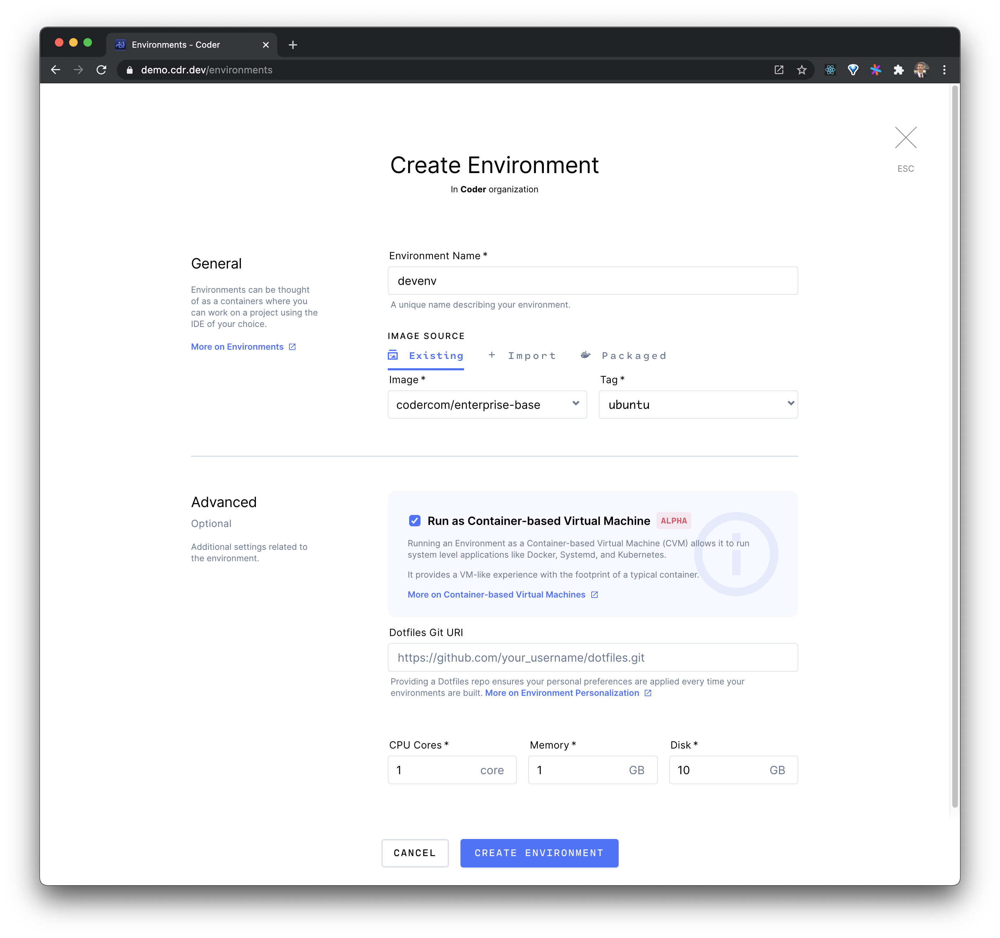

Standard Coder Environments run as normal Docker containers. This carries
limitations as to what applications you can run inside your Environment.
Most notably, it's not possible to run Docker securely within normal Docker
containers.

Coder offers an alternative Environment deployment option that allows you to
run Docker, Docker Compose, systemd, and other system-level applications
securely within your development containers. We call this environment variant
a *Container-based Virtual Machine (CVM)*.

## Container-based Virtual Machine

By choosing this option,
your Environment behaves like a VM or raw host, yet retains the image, security,
and performance properties of typical containers.

To create an Environments capable of securely running system-level applications
like Docker, check the `Run as Container-based Virtual Machine` box when you
create a new Environment.



## systemd

During Environment startup, Coder checks for the presence of `/sbin/init` within
the Environment Image. If the file exists, it's used as the container entrypoint
with a `PID` of 1. If your image OS distribution does not link the `systemd`
init to `/sbin/init`, you'll need to do this manually in your Dockerfile.

The following snippet demonstrates how an image can specify `systemd` as the
init.

```Dockerfile
FROM ubuntu:20.04
RUN apt-get update && apt-get install -y \
    build-essential \
    systemd

# use systemd as the init
RUN ln -s /lib/systemd/systemd /sbin/init
```

## Adding Docker

Be sure to install the `docker` packages into your Environment Image. For a
seamless experience, use [systemd](#systemd) and register the `docker` service
so `dockerd` is automatically run during initialization.

The following snippet demonstrates how an image can registry the `docker`
service in it's Dockerfile.

```Dockerfile
FROM ubuntu:20.04
RUN apt-get update && apt-get install -y \
    build-essential \
    git \
    bash \
    docker.io \
    curl \
    sudo \
    systemd

# Enables Docker starting with systemd
RUN systemctl enable docker

# use systemd as the init
RUN ln -s /lib/systemd/systemd /sbin/init
```

## Disk

Standard environments only persist the `/home` directory in your Environment
disk. CVM Environments have additional levels of persistence:

1. `/var/lib/docker` is stored in your Environment disk and is persisted
between rebuilds.
This prevents shutdowns and rebuilds from purging the Docker cache.

2. The Environment Image is itself stored in your Environment disk.
Note that this data is never directly accessible to you but will still consume
data on your disk and count towards the size limit.

When setting default disk sizes for [Images](../images/index.md), plan for these
additional storage requirements. We recommend treating the environment as a full
machine, so disk sizes in the range of 50-100 GB are reasonable.
This is especially true if users of the image are storing large Docker caches.
