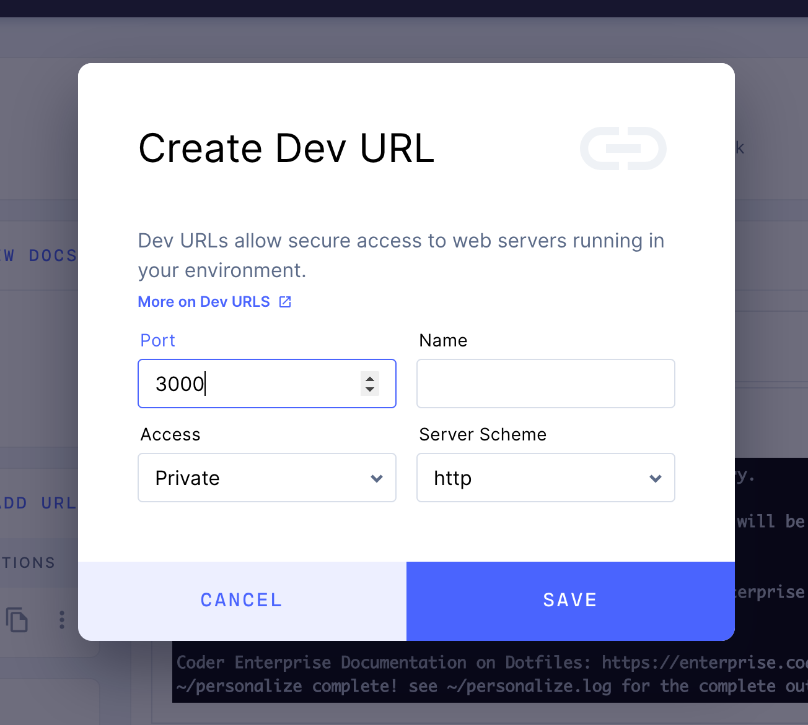
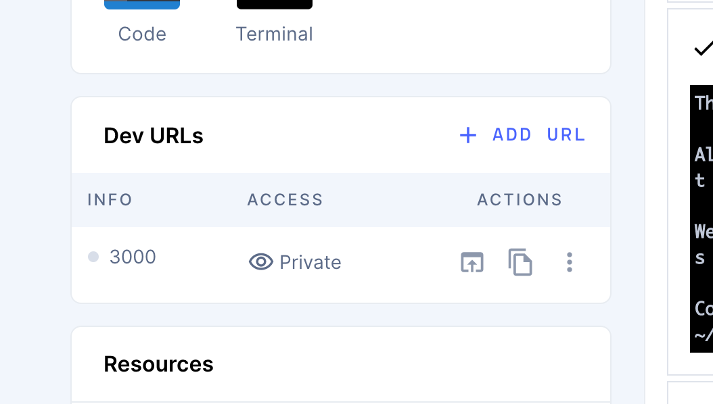

Developer (Dev) URLs allow you to access the web services you're developing in
your environment.

> You must have [DevURLs enabled](../admin/devurls.md) in your installation.

## Creating a Dev URL

You can create a Dev URL from the environment overview page.

In the **Dev URLs** section, click **Add URL**. First, provide the **port**
number you want to be used and a friendly **name** for the URL (optional). Next,
indicate who can **access** the URL and the **internal server scheme** (e.g., whether
Coder should use HTTP or HTTPS when proxying requests to the internal server).



## Access Control

You can set the access level for each Dev URL:

- **Private** - Only the owner of the environment can access the URL
- **Organization** - Anyone in the same organization as the environment can
  access the URL
- **Authorized Users** - Anyone logged in to your Coder instance can access the
  URL
- **Public** - Anyone on the internet can access the URL

## Using Dev URLs

To access a Dev URL, you can click:

- The **Open in browser** icon to launch a new browser window
- The **Copy** button to copy the URL for sharing



### Direct Access

There are two ways for you to construct DevURLs.

If you provided a name for the Dev URL when you created it:

```text
<name>-<username>.domain
```

If didn't provide a name for the Dev URL when you created it:

```text
<port>-<environment_name>-<username>.domain
```

For example, let's say that you've created a Dev URL for port `8080`. Also:

- Username: `user`
- Domain: `acme.com`
- Environment: `my-project`

If you didn't name your Dev URL, then your URL is
`8080-my-project-user.acme.com`.

If, however, you named the Dev URL `reactproject`, then your URL is
`reactproject-user.acme.com`.

> If you directly access a Dev URL that hasn't been created, Coder automatically
> adds it to your Dev URL list on the dashboard with an access level of
> **Private**.
