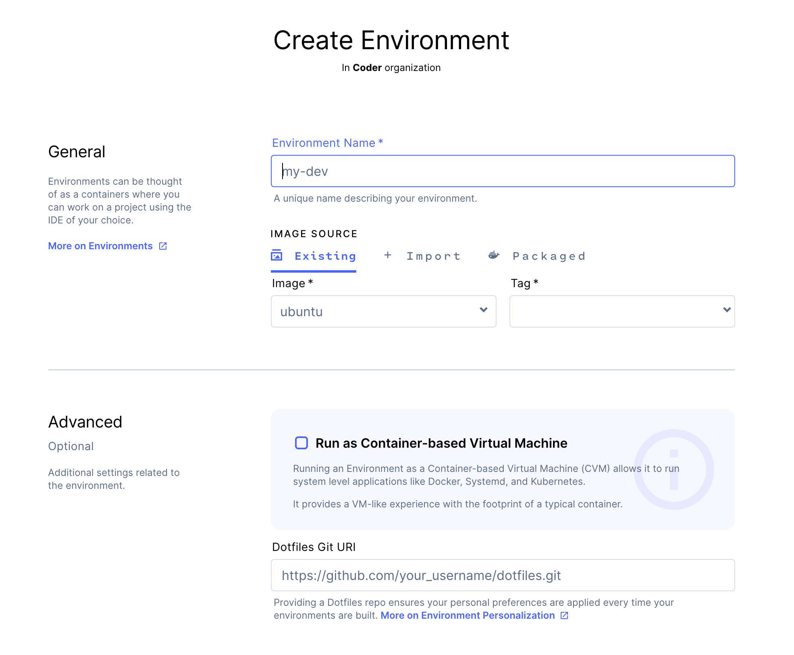
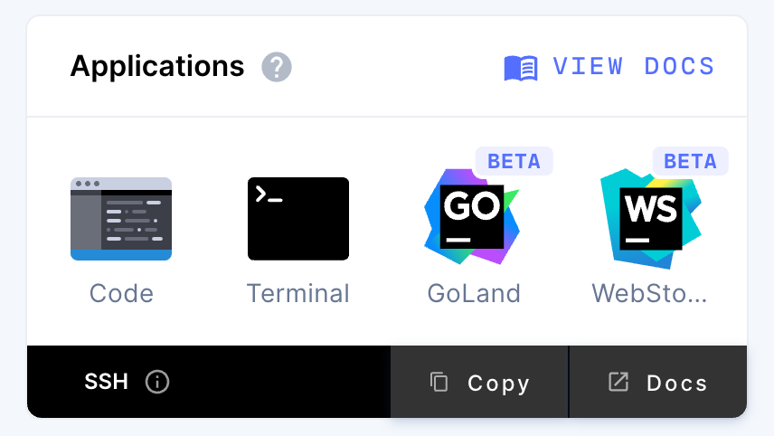

## 1. Import an Image

Ensure you've [imported an Image](../images/importing.md) for your
[Environment](index.md) to use.

## 2. Create an Environment

If this is your first time using Coder, you'll see a **Create Environment**
button in the middle of your screen; otherwise, you'll see a list of your
existing environments. Click the **New Environment** button.

Enter a friendly name for your environment, along with an
[Image](../images/index.md) to use.

When done, click **Create** to proceed. Coder redirects you to an overview page
for your environment during the build process. Learn more about the Environment
[creation parameters](./environment-params.md).

Your environment persists the home directory, updates to new versions of the image,
and runs custom configuration on startup. Learn about the [environment lifecycle](lifecycle.md).

### Advanced

Coder provides advanced settings that allow you to customize your environment.
You can choose to run your environment as a [Container-based Virtual Machine](cvms.md),
and specify custom resources.

> By default, Coder allocates resources (CPU Cores, Memory, and Disk Space)
> based on the parent image.
>
> Coder displays a warning if you choose your resource settings and they're less
> than the image-recommended default, but you can still create the environment.

## 3. Start Coding

Once you've created an Environment, it's time to hop in. Read more about how to
[connect your favorite Editor or IDE](./editors.md) with your new Environment!

> [Integrate with Git](./personalization#git-integration) to automatically have
your SSH key injected into Environments.
